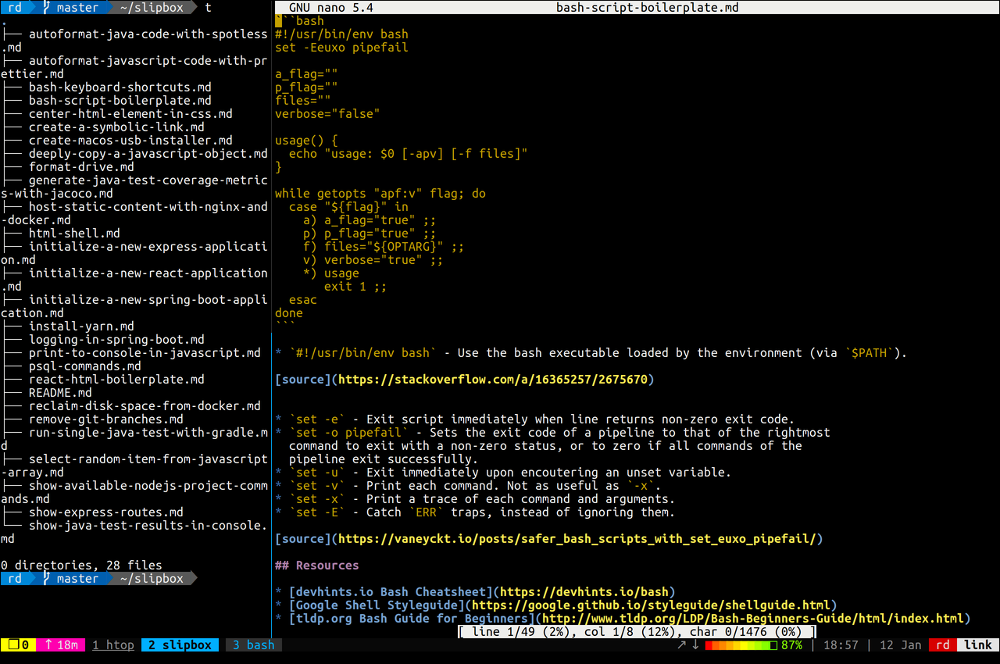

# Ubuntu for Development

How to get a development environment up and running on Ubuntu.

This guide assumes you have a dedicated laptop or desktop computer for this
process, and that you have made a backup of any personal data that is on 
the machine.
